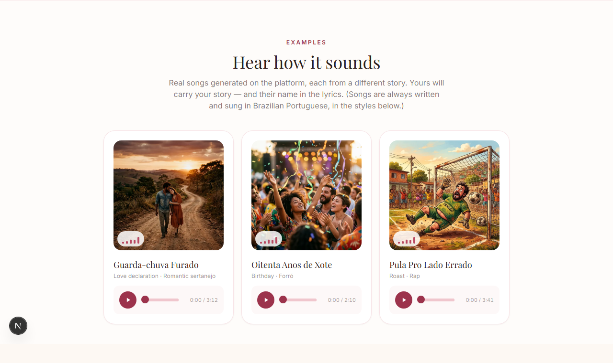
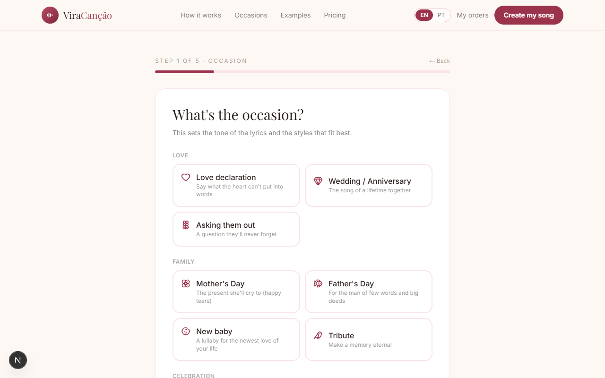
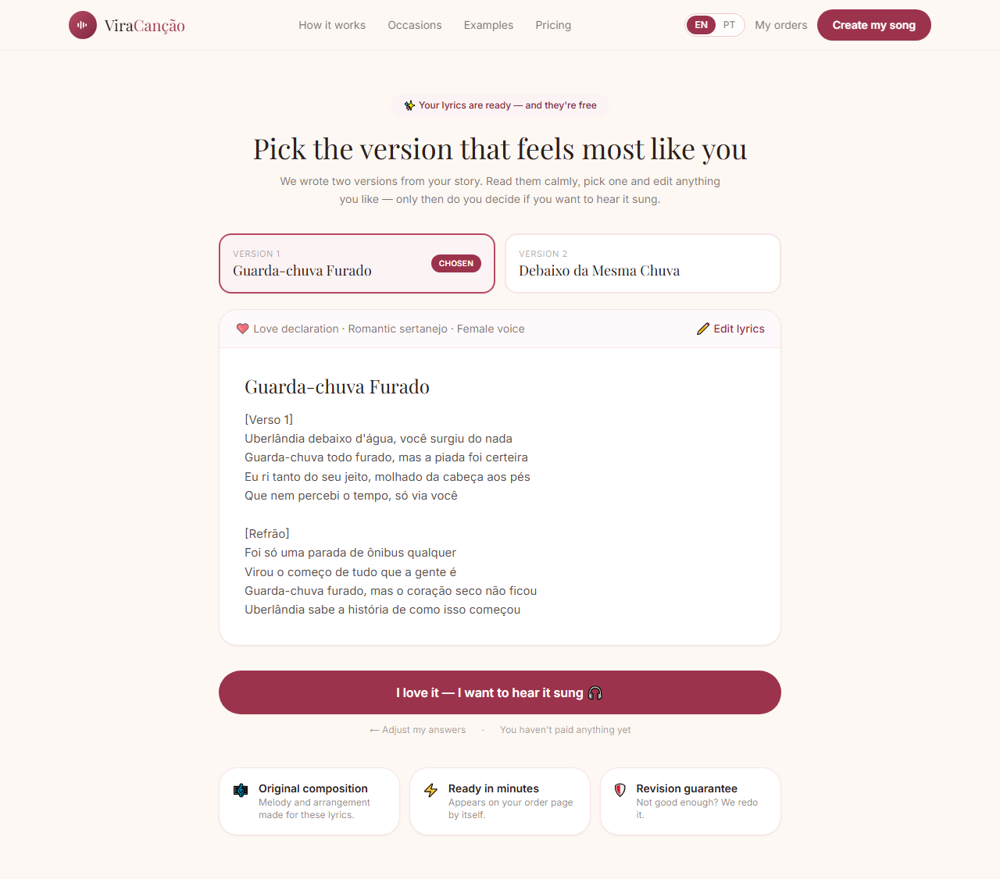
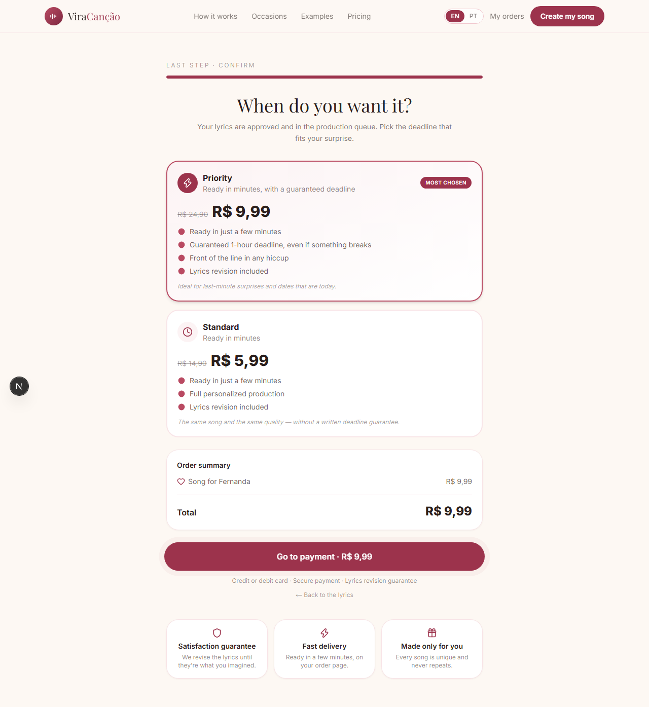
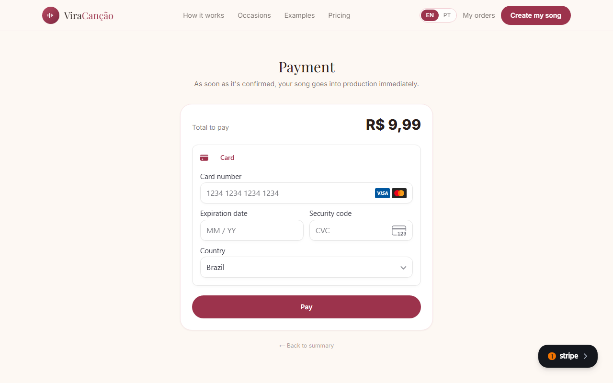
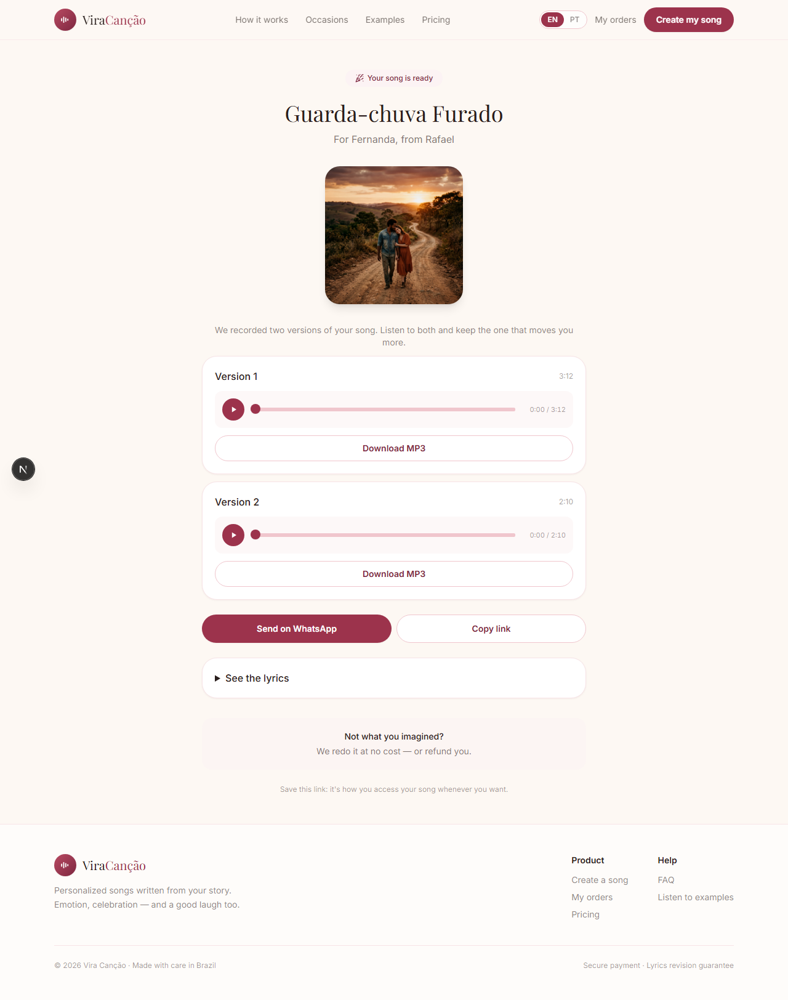
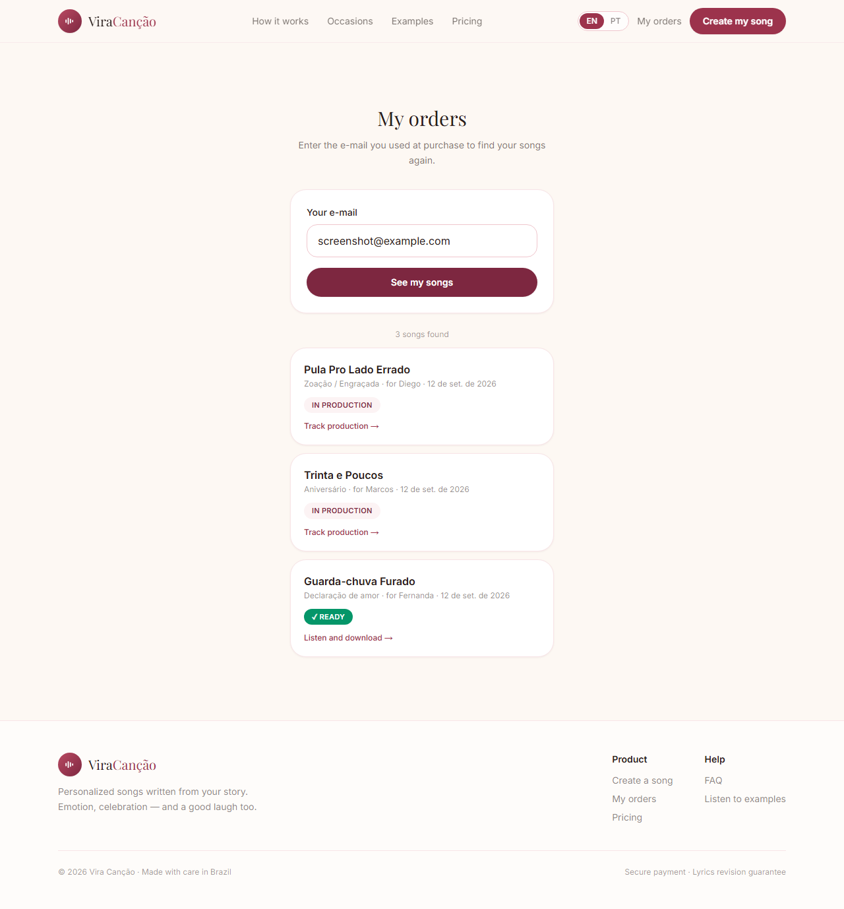

<div align="center">


# Vira Canção

**Um gerador de música por IA com fluxo de pagamento real — da história de um desconhecido até uma faixa pronta e cantada.**

[](https://nextjs.org/)
[](https://www.typescriptlang.org/)
[](https://supabase.com/)
[](https://stripe.com/)
[](https://tailwindcss.com/)
[](https://developers.cloudflare.com/r2/)
[](LICENSE)

[🇺🇸 Read in English](README.md) · **Português (BR)**

</div>

> ⚠️ **Este deploy processa pagamentos reais** pela API da Stripe. Concluir o checkout cobra um cartão de verdade e gera uma música de verdade. Não precisa pagar pra ver o produto funcionando — a letra é gerada e pode ser editada livremente antes de qualquer cobrança.

---

## Sumário

- [Screenshots](#screenshots)
- [Por que esse projeto existe](#por-que-esse-projeto-existe)
- [O que ele realmente faz](#o-que-ele-realmente-faz)
- [Funcionalidades](#funcionalidades)
- [Stack](#stack)
- [Arquitetura](#arquitetura)
- [Decisões de engenharia que valem a pena mencionar](#decisões-de-engenharia-que-valem-a-pena-mencionar)
- [Modelo de segurança](#modelo-de-segurança)
- [Estrutura do projeto](#estrutura-do-projeto)
- [Rodando localmente](#rodando-localmente)
- [Roadmap](#roadmap)
- [Licença](#licença)

---

## Screenshots

### Interface bilíngue, sem recarregar a página

Trocar de idioma reescreve o cookie e atualiza a árvore do servidor — sem mudar de rota, sem perder estado de formulário.


### Player de áudio customizado, com barra de busca que funciona de verdade

Os controles nativos de `<audio>` não deixavam espaço suficiente pra buscar a música num card estreito — esta é a correção, arrastando por uma música real gerada na plataforma.


### O funil

|                                          Página inicial                                          |                                        Exemplos funcionando                                        |
| :----------------------------------------------------------------------------------------------: | :------------------------------------------------------------------------------------------: |
| <br>_O pitch, numa tela só_ | <br>_Músicas reais geradas, tocáveis inline_ |

|                                          Seleção de ocasião                                          |                                        Letra, antes de qualquer pagamento                                        |
| :----------------------------------------------------------------------------------------------: | :------------------------------------------------------------------------------------------: |
| <br>_Passo 1 de 5 — define tom, prompt e estilos sugeridos_ | <br>_Duas versões escritas por IA, geradas em paralelo e livremente editáveis_ |

|                                          Checkout                                          |                                        Pagamento (Stripe Elements)                                        |
| :----------------------------------------------------------------------------------------------: | :------------------------------------------------------------------------------------------: |
| <br>_Preço calculado no servidor — o cliente nunca manda um valor_ | <br>_Elemento de cartão montado direto pela Stripe, tokenizado no navegador_ |

### Depois do pagamento

|                                          Pedido entregue                                          |                                        Suas próprias músicas, quando quiser                                        |
| :----------------------------------------------------------------------------------------------: | :------------------------------------------------------------------------------------------: |
| <br>_As duas versões, capa, compartilhar e baixar — o momento pra que o produto existe_ | <br>_Consulta toda música ligada a um e-mail, sem login — estados misturados de em-produção/pronta_ |

_A interface troca entre inglês e português; os screenshots estáticos acima mostram a versão em inglês. As músicas são sempre escritas e cantadas em português do Brasil._

---

## Por que esse projeto existe

Isso começou como uma ideia comercial de verdade — um concorrente brasileiro de um serviço existente de "música personalizada por IA" — e eu construí tudo sozinho: decisões de produto, backend, frontend, pagamentos e o pipeline de IA que transforma a história de um estranho numa faixa pronta. Hoje é apresentado como projeto de portfólio em vez de negócio, mas nada foi simplificado pra chegar até aqui — mesmo código, mesmas integrações, mesmo processamento real de pagamento que um cliente pagante encontraria.

É também uma vitrine de ponta a ponta de um app full-stack com cara de produção: cálculo de preço só no servidor, um fluxo de pagamento reconferido independentemente do que o cliente afirma, uma condição de corrida corrigida no nível do banco em vez de com um mutex, e um pipeline de produção híbrido onde um humano cobre silenciosamente a IA quando ela falha.

## O que ele realmente faz

1. Um wizard curto coleta a ocasião, o destinatário, uma história em texto livre e um estilo musical (14 gêneros, do sertanejo romântico ao rap de "zoeira").
2. Uma LLM (Claude Haiku, via um agregador de IA) escreve **duas** versões diferentes da letra em paralelo, transmitidas pra tela conforme cada uma termina — não é uma única chamada bloqueante.
3. O cliente edita a letra escolhida palavra por palavra, depois paga com cartão de crédito ou débito pelo Stripe Elements, embutido direto na página.
4. A confirmação do pagamento dispara a produção musical: um motor baseado em Suno (pelo mesmo agregador) grava a música com a letra editada e o vocabulário/tom do estilo escolhido.
5. Se o motor automático falhar por qualquer motivo, o pedido cai silenciosamente numa fila manual em vez de falhar pro cliente — um operador termina o trabalho na mão e o cliente nunca percebe a diferença.
6. A música pronta (as duas versões, com capa incluída) aparece sozinha na página do pedido, sem precisar recarregar.

---

## Funcionalidades

### 🪄 Wizard e letras
- Wizard de 5 passos cobrindo ocasião, destinatário, relacionamento, história em texto livre e estilo musical.
- Duas versões de letra escritas em paralelo a partir de prompts com ângulos diferentes, transmitidas ao cliente como NDJSON em vez de uma única chamada bloqueante.
- Cada um dos 14 estilos musicais tem sua própria orientação de vocabulário, tamanho de verso, densidade de rima e imagens injetada no system prompt da LLM — não é só uma tag de instrumentação.
- A letra é livre pra gerar e editar, palavra por palavra, antes de existir qualquer pagamento.

### 💳 Pagamentos
- Stripe Elements + a API de PaymentIntents — o cartão é tokenizado no navegador, o servidor nunca toca nele.
- O valor cobrado é sempre calculado no servidor a partir da linha do pedido; o cliente só pode mandar um `orderId` e nada mais (comprovado com testes adversariais que forjam o valor e confirmam que ele é ignorado).
- PaymentIntents são reaproveitados entre recarregamentos em vez de duplicados — uma checagem de idempotência por pedido.
- A verdade do pagamento é checada duas vezes: uma via webhook da Stripe (`payment_intent.succeeded`), independentemente via polling do cliente que reconfere o mesmo PaymentIntent na API da Stripe — qualquer um dos dois caminhos sozinho já basta pra liberar o pedido.

### 🎵 Produção musical
- Geração baseada em Suno via o agregador crun.ai, disparada automaticamente na confirmação do pagamento.
- Produção híbrida: se o motor automático falha (timeout, resposta ruim, rate limit), o pedido cai silenciosamente numa fila manual em vez de falhar pro cliente.
- Uma condição de corrida na finalização de job (duas abas fazendo polling ao mesmo tempo) é fechada com um único `UPDATE ... WHERE status IN (...)` condicional, não um mutex.
- O áudio final e a capa ficam no Cloudflare R2, servidos por URLs assinadas de curta duração.

### 🌍 Bilíngue por design
- O idioma da interface vive num cookie, não na URL — um link `/pedido/<token>` já compartilhado nunca quebra quando o idioma padrão muda.
- O dicionário são dois arquivos paralelos (português como fonte da verdade, inglês como espelho); `type Dict = typeof pt` faz o compilador do TypeScript recusar o build se uma chave estiver faltando em qualquer um dos dois.
- Idioma da interface e idioma da música são independentes — as músicas são sempre escritas e cantadas em português do Brasil, seja qual for o idioma da interface, já que é isso que os gêneros do seletor de estilo realmente são.

### 🛡️ Prevenção de abuso
- Cloudflare Turnstile na frente do endpoint (gratuito) de geração de letra, antes dele rodar.
- Cinco camadas de rate limit empilhadas, da mais fácil à mais difícil de forjar: IP (frouxo, considerando CGNAT), cookie de dispositivo, fingerprint do navegador, e-mail, e um teto global diário opcional — com uma allowlist limpa pra testar sem esbarrar em nenhuma delas.
- Toda tentativa de geração é registrada (IP, dispositivo, fingerprint, um hash da história — nunca a história em si) e vira uma pontuação heurística de suspeita: volume alto sem nenhuma compra, o mesmo hash de história repetido em várias tentativas (uma pessoa de verdade não redigita a mesma história; um script sim), rotação de IP/e-mail no mesmo aparelho, domínios de e-mail descartável. A pontuação *ordena* os suspeitos pra revisão humana em `/admin/abuso` — ela sinaliza, não condena sozinha; uma compra de verdade derruba bastante a pontuação.

### 🔐 Ferramentas de admin
- `/admin` fica fechado por padrão — sem `ADMIN_SECRET` configurado dá 503, não um painel aberto. O acesso é uma chave de 256 bits trocada uma vez via parâmetro de URL por um cookie `httpOnly` (assim a chave não fica no histórico do navegador depois disso), com rate limit persistente entre instâncias contra tentativas erradas e comparação em tempo constante pra não vazar a chave pelo tempo de resposta.
- A fila manual de produção (`/admin/fila`) é a metade humana do pipeline híbrido descrito acima: ordenada por plano primeiro, então "prioritário" é uma posição de fila de verdade e não só discurso de venda, sinaliza pedidos que passaram do SLA prometido, e entrega ao operador tudo que precisa pra reproduzir o job na mão — as tags de estilo exatas e a letra, prontas pra colar na própria conta Suno dele.

---

## Stack

| | |
|---|---|
| **Next.js 15 (App Router)** | Front-end e back-end no mesmo deploy — as rotas de API são funções serverless. |
| **Supabase (Postgres)** | Banco relacional, acessado só pelo servidor via service role key. |
| **Stripe** | Pagamento com cartão via Stripe Elements e a API de PaymentIntents — o cartão é tokenizado no navegador, o servidor nunca vê o número e só confia no que ele mesmo reconfere na API da própria Stripe. |
| **Cloudflare R2** | Armazenamento de áudio e imagem, servido por URLs assinadas de curta duração. |
| **crun.ai** | Agregador de IA: Suno pra geração musical, Claude Haiku pras letras, Nano Banana pra capa/fotos de demonstração. |
| **Cloudflare Turnstile** | Verificação de humanidade antes de qualquer geração que custa dinheiro. |

Sem ORM, sem SDK pesado onde um `fetch` resolve — o cliente do crun.ai e o do R2 são wrappers feitos à mão, com política explícita de retry/tratamento de erro, de propósito; a Stripe é a exceção, porque reimplementar verificação de assinatura de webhook/PaymentIntent na mão seria só reinventar uma roda crítica de segurança.

---

## Arquitetura

Tudo roda como um único deploy do Next.js — sem backend separado. As rotas de API são o backend; Supabase, Stripe e crun.ai são os únicos sistemas externos.

```
                              NAVEGADOR
                                 │
                       ┌─────────▼──────────┐
                       │   Interface Next.js │   wizard → letra → checkout → pagamento → pedido
                       └─────────┬──────────┘
                                 │ fetch (rotas de API, mesmo deploy — sem backend separado)
                       ┌─────────▼──────────┐
              ┌────────┤     Rotas de API    ├────────┐
              │        └─────────┬──────────┘        │
              ▼                  ▼                    ▼
      Claude Haiku          API da Stripe        Supabase (Postgres)
   (letra, transmitida    (PaymentIntent +      orders · payments · jobs
   como NDJSON, pré-pago) webhook, pós-pago)     rate limits · log de abuso
                                 │
                   pagamento confirmado (webhook OU polling — qualquer um basta)
                                 │
                       ┌─────────▼──────────┐
                       │   crun.ai / Suno     │   job de produção musical
                       └─────────┬──────────┘
                                 │ callback do provedor, ou sweep por cron como reforço
                       ┌─────────▼──────────┐
                       │   Cloudflare R2     │   áudio final + capa, URLs assinadas
                       └────────────────────┘
```

Se o callback do crun.ai nunca chegar (soluço do provedor, falha de rede), um sweep agendado (`/api/production/sweep`, cron do `vercel.json`) reconfere os jobs em andamento direto no provedor, em vez de confiar só no callback.

---

## Decisões de engenharia que valem a pena mencionar

**Produção híbrida: o robô vai primeiro, um humano nunca está longe.** As músicas são geradas automaticamente por uma fila de jobs. Se o provedor falha — timeout, resposta ruim, rate limit — o pedido cai silenciosamente numa fila de tratamento manual. O cliente nunca vê o estado interno; a página do pedido só diz "em produção" até a música existir de verdade, seja porque um robô ou uma pessoa fez acontecer.

**Uma condição de corrida corrigida com UPDATE atômico, não um mutex.** Duas chamadas concorrentes finalizando o mesmo job (ex.: duas abas abertas fazendo polling ao mesmo tempo) inseriam faixas duplicadas. A correção foi transformar "finalizar este job" num `UPDATE ... WHERE status IN ('queued','running')` condicional, que o Postgres já serializa sozinho — só quem chega primeiro consegue trocar o status, o segundo vê zero linhas afetadas e desiste.

**O valor cobrado nunca vem do cliente.** Em certo ponto, a rota de pagamento lia o valor da transação direto do payload que o navegador mandava, só caindo pro valor do banco se esse campo estivesse ausente. Um payload adulterado podia pagar centavos por um pedido que valia muito mais. A correção: o servidor calcula o preço a partir da linha do pedido e usa *só* isso pra criar o PaymentIntent da Stripe — o cliente manda um `orderId` e nada mais, e um teste adversarial confirma que um campo de valor forjado é simplesmente ignorado.

**Letra em streaming, não em lote.** As duas versões da letra costumavam vir de uma única chamada bloqueante. Agora são geradas em paralelo a partir de dois prompts com ângulos diferentes e transmitidas ao cliente como NDJSON — a primeira versão chega na tela bem antes da segunda terminar, em vez do usuário ficar olhando um spinner esperando as duas.

**Cada gênero musical tem a própria voz.** No início, escolher um estilo só mudava a tag de instrumentação mandada pro motor de áudio — a letra em si saía estruturalmente idêntica fosse forró, rap ou uma cantiga de ninar. A correção foi dar a cada um dos 14 estilos sua própria orientação de vocabulário, tamanho de verso, densidade de rima e imagens, injetada direto no system prompt da LLM.

**i18n sem prefixo de rota.** O idioma da interface vive num cookie, não na URL, então nenhum link `/pedido/<token>` já entregue a um cliente quebra quando o idioma padrão muda. O dicionário em si são dois arquivos (português como fonte da verdade, inglês como objeto paralelo) — `type Dict = typeof pt` faz o compilador do TypeScript recusar o build se o arquivo em inglês estiver faltando uma chave que o português tem.

**Invariante de pagamento verificado duas vezes.** Se um pedido conta como "pago" é decidido por um único predicado compartilhado (`isPaidOrBeyond`), checado tanto pelo endpoint que libera a música pronta *quanto* independentemente dentro da própria função que inicia a produção — assim, um futuro caminho de código que esquecer a checagem ainda assim não consegue entregar uma música de um pedido que nunca foi pago de verdade.

**Rebloquear alguém falhava silenciosamente — rastreado até um índice único parcial.** A tabela `blocks` só aplica unicidade `WHERE active`, de propósito: isso permite bloquear a mesma identidade de novo mais tarde sem um falso duplicado depois que um bloqueio anterior expira. O Postgres não consegue mirar um índice parcial com `ON CONFLICT`, então uma ação de "bloquear" baseada em upsert simplesmente engolia o conflito e não fazia nada. A correção: nunca fazer upsert aqui — desativa explicitamente qualquer bloqueio ativo existente, depois insere uma linha nova, o que como efeito colateral mantém o histórico completo de todo bloqueio já aplicado em vez de sobrescrever.

**Um pedido pago pode ficar preso com zero jobs de produção — e agora se autocura.** `startProduction` costumava rodar como uma promise solta logo depois de marcar um pedido como pago. No runtime serverless da Vercel isso é perigoso: a instância da function pode ser congelada no instante em que a resposta HTTP é enviada, matando o trabalho antes mesmo dele inserir uma linha de job. Aconteceu com um pagamento real, ao vivo. Corrigido na origem com `after()` (que faz a Vercel manter a instância viva até o trabalho realmente terminar), mais uma rede de segurança tanto na página do pedido quanto no sweep diário do cron, que detecta "pago sem nenhum job" depois de uma janela curta de tolerância e tenta de novo.

---

## Modelo de segurança

| Camada | Como é aplicada |
|---|---|
| **Valor do pagamento** | Calculado no servidor a partir da linha de `orders`; o cliente só consegue mandar um `orderId`. Nunca confiado a partir do payload da requisição. |
| **Verdade do pagamento** | Nunca aceita de bandeja do cliente nem de um webhook não verificado — sempre reconferida independentemente na própria API de PaymentIntents da Stripe antes de marcar um pedido como pago. |
| **Autenticidade do webhook** | Assinatura verificada via `stripe.webhooks.constructEvent` contra o corpo bruto da requisição; cai pra reconferir direto na API da Stripe se não houver segredo de webhook configurado — falha fechado, não aberto. |
| **Abuso de bot/script** | Cloudflare Turnstile na frente do endpoint (gratuito, baseado em LLM) de geração de letra. |
| **Rate limiting** | Cinco camadas empilhadas — IP, cookie de dispositivo, fingerprint do navegador, e-mail, teto global diário opcional — cada uma mais difícil de forjar que a anterior. |
| **Endpoints internos** | As rotas de início de produção/override manual exigem um `ADMIN_SECRET` via bearer token; o sweep do cron exige `CRON_SECRET`. Nenhum dos dois é alcançável sem isso. |
| **Painel de admin** | Fechado por padrão (sem chave configurada = 503, não aberto). A chave é trocada uma vez via parâmetro de URL por um cookie `httpOnly`, protegida por rate limit persistente contra tentativas erradas e comparação em tempo constante. |
| **Acesso ao banco** | A service role key do Supabase só é usada em código do servidor — nunca chega ao navegador. |

---

## Estrutura do projeto

```
app/
├── api/                    # backend — cada rota abaixo é uma função serverless
│   ├── checkout/           # criação do pedido, PaymentIntent da Stripe, polling de status
│   ├── webhooks/stripe/    # confirmação de pagamento com assinatura verificada
│   ├── generate-lyrics/    # transmite NDJSON da LLM
│   ├── production/         # início, override manual, callback do provedor, sweep do cron
│   └── ...
├── criar/                  # o wizard: ocasião → letra → checkout → pagamento
├── pedido/[token]/         # a página de pedido/entrega voltada pro cliente
└── admin/                  # fila manual + revisão de abuso, protegida por ADMIN_SECRET

components/
├── wizard/                 # um componente por passo do wizard
└── AudioPlayer.tsx          # player customizado — os controles nativos não deixavam espaço pra buscar

lib/
├── music/                  # cliente do crun.ai + orquestrador de produção
├── dict/{pt,en}.ts          # o dicionário bilíngue inteiro, paridade de chaves garantida pelo TypeScript
├── stripe.ts, r2.ts         # clientes de provedor feitos à mão
├── rate-limit.ts, abuse.ts  # a defesa de abuso em 5 camadas
└── order-status.ts, payment-confirmed.ts   # o predicado único e compartilhado de "isso está pago de verdade"

supabase/migrations/         # aplicadas com node scripts/migrate.js <arquivo>
scripts/                     # testes adversariais e2e (adulteração de valor, deduplicação, etc.)
```

---

## Rodando localmente

```bash
npm install
cp .env.example .env.local   # preencha com suas próprias chaves
npm run dev
```

Precisa (no mínimo) de credenciais do Supabase, da Stripe em **modo teste**, e de uma API key do crun.ai — o app degrada graciosamente sem a maioria delas (pagamento e geração mostram um estado claro de "não configurado" em vez de quebrar), mas nada funciona de ponta a ponta sem elas. As migrations do banco ficam em `supabase/migrations/` e são aplicadas com `node scripts/migrate.js <arquivo>`.

O Cloudflare Turnstile bloqueia navegadores headless/automatizados por design (é literalmente o propósito do widget), o que também bloqueia ferramentas de teste ponta a ponta como o Playwright. Definir `NEXT_PUBLIC_TURNSTILE_TEST=1` troca pelas chaves de demonstração da própria Cloudflare (sempre aprovam) — mas só quando `NEXT_PUBLIC_SITE_URL` aponta pra `localhost`, então a flag não tem como desligar a verificação de verdade em produção sem querer.

---

## Roadmap

- [ ] Pix como segundo método de pagamento além do cartão — travado do lado da Stripe: esta conta precisa de acesso liberado por convite antes de `pix` poder entrar em `payment_method_types` (incluir sem esse acesso faz a Stripe recusar a criação do PaymentIntent inteiro, confirmado na conta real). O handler de webhook e o polling de confirmação já dão suporte sem nenhuma mudança a mais assim que o acesso for concedido.
- [ ] Suíte de testes ponta a ponta automatizada, ligada em CI (os scripts adversariais/e2e em `scripts/` hoje rodam na mão)
- [ ] Autenticação de admin de verdade, no lugar de um único `ADMIN_SECRET` compartilhado via bearer token
- [ ] Mais idiomas de interface além de inglês/português, reaproveitando o padrão `Dict = typeof pt` já existente

---

## Licença

Distribuído sob a [Licença MIT](LICENSE) — © 2026 Luis Eduardo.

<div align="center">

Construído sozinho por [@merino626](https://github.com/merino626).

</div>
